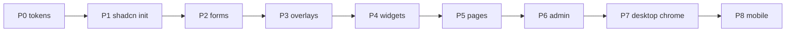

# Frontend visual refresh (full reskin via subagents)

**End state:** same product and information architecture, visually refreshed Cal Poly green/gold UI, shadcn/ui on Tailwind v4. Not a Next.js rewrite; not new copy.

**How to run:** one **subagent per phase**, in order. Do not start phase N+1 until N is **committed** on this branch and green on lint/Vitest plus the phase verify list. Parent orchestrates: paste the phase prompt, review, then launch the next.

**Landing (for now):** keep **PR-sized slices** (one phase = one commit) on `feat/frontend-theme-tokens`. **Do not push.** Later those commits can be split into separate PRs. Do not squash phases together. Include `docs/frontend-ui-refresh.md` status updates in the same commit as the phase work.

Keep React, Vite, Tailwind v4, React Router, tRPC. Playwright 1:1 with `packages/e2e/docs` — change specs first if roles/names must change. Frontend conventions: `index.ts` re-exports, no `../` imports, one public component per file (`components/ui/*` generated by shadcn is the exception).

| Phase | Status | Slice |
| --- | --- | --- |
| 0 Tokens | **Done** `feat/frontend-theme-tokens` `3347577` | `@theme`, `cn()`, shared field classes |
| 1 shadcn init | **Done** `feat/frontend-theme-tokens` `ea2f6ee` | Init + map CSS vars onto Phase 0 tokens |
| 2 Form primitives | **Done** `feat/frontend-theme-tokens` `6dd1bd4` | Wrap existing form APIs |
| 3 Overlays | **Done** `feat/frontend-theme-tokens` `e0d9217` | Dialog, toast, mobile nav |
| 4 Widgets | **Done** `feat/frontend-theme-tokens` `fd6f2a5` | Combobox, slider, stars, spinner |
| 5 Page restyle | **Done** `feat/frontend-theme-tokens` `752f622` | Home, search, professor, static pages |
| 6 Admin + cleanup | **Done** `feat/frontend-theme-tokens` `a8cb7a9` | Admin table; remove leftover UI packages |
| 7 Desktop chrome | **Done** (local commits) | Screenshot audit + opinionated shadcn controls; shared static-page header and About/FAQ refresh (desktop) |
| Professor profile | **Done** `feat/frontend-theme-tokens` `46d3d0f` | Information-first professor page matching search/list chrome |
| Professor readability | **Done** (local) | Scale up type, stats, review cards, and controls for scanability |
| Course filter | **Done** (this commit) | Department chips that reveal course numbers on desktop; grouped select on mobile |
| 8 Mobile | **Done** (this commit) | Nav sheet, filter sheet, search bar width, dialogs, professor stats, touch targets |

After each phase, the subagent updates this table (status + commit SHA), makes **one git commit** on `feat/frontend-theme-tokens`, **does not push**, and does not start the next phase.

---

## Shared constraints

- Map onto Phase 0 tokens; do not invent a second palette.
- Nunito: `--font-nunito` exists; `body` applies `font-nunito` (Phase 1).
- Skip unless a phase names them: search virtualizer, 4k slider hack, `useLocationState` leak.

**Token map** ([`packages/frontend/src/index.css`](../packages/frontend/src/index.css)):

| Token | Hex / note | shadcn |
| --- | --- | --- |
| `--color-cal-poly-green` | `#1f4715` | `--primary` |
| `--color-cal-poly-gold` | `#bd8b13` | `--accent` |
| `--color-cal-poly-light-green` | `#d7eace` | muted / chips |
| `--color-field` / `-border` / `-active` | `#f2f5f8` / `#c3cdd5` / `#f2feff` | `--input` |
| `--height-screen-wo-nav` | navbar `h-14` | keep |

Reuse [`cn()`](../packages/frontend/src/utils/cn.ts) from `@/utils`.

---

## Phase 0 — done

CSS-only theme, `cn()`, [`fieldControlClassName`](../packages/frontend/src/components/forms/fieldClassName.ts), hex gone from forms/slider/stars, `Button` exported from forms, JS Tailwind config removed.

---

## Phase 1 — shadcn init

**In:** `npx shadcn@latest init` in `packages/frontend` (Vite + Tailwind v4). `components.json`. Map shadcn CSS variables onto the table above. Reuse `cn()`. Optional Nunito on `body`.

**Out:** wrapping forms, replacing modal/toast/nav, page restyle, extra shadcn components beyond `init`.

**Verify:** lint, frontend Vitest. No e2e change.

**Subagent prompt:**

> Read `docs/frontend-ui-refresh.md`. Implement **Phase 1 only**. Init shadcn (Vite, Tailwind v4) in `packages/frontend`, map CSS variables onto existing `@theme` tokens, reuse `cn()`. Do not wrap forms or restyle pages. Update the status table, commit once on `feat/frontend-theme-tokens`, do not push, stop.

---

## Phase 2 — form primitives

**In:** Add shadcn `button`, `input`, `textarea`, `checkbox`, `select`. Wrap existing APIs in `packages/frontend/src/components/forms/` (`primary` / `secondary` / `tertiary`). Keep [`Button.a11y.spec.tsx`](../packages/frontend/src/components/forms/Button.a11y.spec.tsx); add axe tests for new wrappers if cheap.

**Out:** dialog, toast, navbar, Downshift, pages.

**Verify:** lint, Vitest/axe, spot-check login / new professor / evaluate.

**Subagent prompt:**

> Read `docs/frontend-ui-refresh.md`. Implement **Phase 2 only**. Wrap existing form components with shadcn primitives; keep public APIs and a11y tests. Do not replace modal/toast/nav. Update the status table, commit once on this branch, do not push, stop.

---

## Phase 3 — overlays (dialog, toast, nav)

**In:** shadcn `Dialog` instead of `react-modal` (`main.tsx`, professor evaluate/report). Sonner instead of `react-toastify` (`App.tsx` Query/Mutation `toast.error`). `Sheet` (or equivalent) instead of `hamburgers.css` + `AnimateHeight` in navbar. Keep skip link, logo, `aria-label="Open Navbar"`. Remove `Modal.setAppElement`.

**Out:** combobox/slider/stars, admin table, page layout restyle.

**Verify:** lint, Vitest, Playwright professor evaluate/report + mobile nav + a11y. Specs first if names change.

**Subagent prompt:**

> Read `docs/frontend-ui-refresh.md`. Implement **Phase 3 only**. Replace react-modal, react-toastify, and hamburger nav with shadcn Dialog, Sonner, and Sheet. Preserve accessible names. Update e2e specs first if needed. Update the status table, commit once, do not push, stop.

---

## Phase 4 — product widgets

**In:**

- Search: Downshift [`AutoComplete`](../packages/frontend/src/components/AutoComplete.tsx) → Command/Combobox. Keep accessible name **Professor Auto-complete** (`search.spec.ts`).
- Filters: `rc-slider` [`MinMaxSlider`](../packages/frontend/src/components/MinMaxSlider.tsx) → shadcn Slider.
- Stars: `react-star-ratings` → small Rating (buttons + icons). Same 0–4 semantics.
- Spinners: `react-spinners` → shadcn Spinner or CSS spinner.

Drop unused packages after each swap. Keep `@heroicons/react` unless lucide is already required.

**Out:** Home/Search/Professor visual redesign, admin table.

**Verify:** lint, Vitest, e2e search + professor + new professor.

**Subagent prompt:**

> Read `docs/frontend-ui-refresh.md`. Implement **Phase 4 only**. Replace Downshift, rc-slider, star ratings, and spinners with shadcn-based widgets. Keep combobox name “Professor Auto-complete”. Do not restyle page layouts. Update the status table, commit once, do not push, stop.

---

## Phase 5 — page restyle (the visible reskin)

**In:** Apply tokens + shadcn density (radius, type, focus rings, spacing) on Home, Search, ProfessorCard, Professor page, New Professor, Login, About, FAQ. Same IA and copy. Optional: Nunito on `body` if still missing.

**Out:** admin table; new routes/features.

**Verify:** browser pass (home → search → professor evaluate/report → new professor → login → FAQ/About; mobile nav). `npm run e2e` and `e2e:a11y`. Desktop + mobile viewports.

**Subagent prompt:**

> Read `docs/frontend-ui-refresh.md`. Implement **Phase 5 only**. Restyle public pages with existing tokens/shadcn. Do not change information architecture or copy. Do not migrate the admin table. Verify in the browser and e2e. Update the status table, commit once, do not push, stop.

---

## Phase 6 — admin + dependency cleanup

**In:** [`Admin.tsx`](../packages/frontend/src/pages/Admin.tsx) `react-data-table-component` → shadcn Table (TanStack Table only if sorting needs it). Remove leftover UI packages. `npm run fix`.

**Done:** mapped rows + shadcn Table (no TanStack Table). Pagination is 10 rows per page with previous/next (same default size as react-data-table-component; no per-page selector). Pending professor rows use an accessible expand/collapse control for submit-under / rename / department actions.

Leftover overlay/widget packages (`react-modal`, `react-toastify`, `downshift`, `rc-slider`, `react-spinners`, `react-star-ratings`) were already removed in Phases 3–4. This phase removes `react-data-table-component`. `react-animate-height` remains (used on `ProfessorPage.tsx`). The professor course sidebar no longer uses `react-anchor-link-smooth-scroll` or `react-intersection-observer`.

**Verify:** lint, Vitest, admin e2e.

**Subagent prompt:**

> Read `docs/frontend-ui-refresh.md`. Implement **Phase 6 only**. Migrate the admin table and remove unused UI dependencies. Update the status table, commit once, do not push. Full reskin is complete when this phase is green.

---

## Phase 7 — desktop: opinionated shadcn + styling audit

Stay on shadcn. Goal: controls look designed (not default nova / not OS chrome), and **less custom code**, not more. **Desktop only** (`md+`). Do not spend this phase on hamburger, stacked filters, or `sm:` layout rework.

### Audit first (anti-patterns to hunt)

Walk public pages at a desktop width and the form/ui layers. Known issues:

| Pattern | Where | Better |
| --- | --- | --- |
| Gray/green selected highlight | Search AutoComplete list: cmdk `data-[selected=true]` is muted green (`--muted` / light green) plus a gray override (`bg-gray-300`). Same family of hover/selected on Command items | One hover/active treatment (prefer accent/gold or a single muted), not gray stacked on Cal Poly green |
| Native `<select>` / native checkbox | [`forms/Select.tsx`](../packages/frontend/src/components/forms/Select.tsx), [`forms/Checkbox.tsx`](../packages/frontend/src/components/forms/Checkbox.tsx) | Radix `Select` + `Checkbox` already in `components/ui` |
| Thin default Slider | [`ui/slider.tsx`](../packages/frontend/src/components/ui/slider.tsx) | Opinionated track/thumb in the primitive; drop extra CSS in [`MinMaxSlider`](../packages/frontend/src/components/MinMaxSlider.tsx) if redundant |
| Double wrapping | [`forms/Button.tsx`](../packages/frontend/src/components/forms/Button.tsx) remaps variants **and** piles `h-auto` / extra green borders | Put Cal Poly look in `ui/button` `cva`; form `Button` becomes a thin re-export |
| Parallel palettes | `cal-poly-*` + `primary`/`accent`/`card`/`field` in the same files | Prefer semantic tokens (`bg-primary`, `border-input`, `bg-card`); keep `cal-poly-*` only where a one-off is clearer |
| Shared field helper duplicating Input | [`fieldClassName.ts`](../packages/frontend/src/components/forms/fieldClassName.ts) vs `ui/input` | One source: ui Input/Textarea classes |
| Copy-paste page chrome | `cardStyle` / `linkStyle` in About + FAQ | One small Card/PageHeader or shared class tokens |
| Template strings vs `cn()` | Navbar, SearchBar, Evaluate form | `cn()` everywhere |
| One-off type | `font-nunito` on evaluate chips | inherit `body` |

Delete wrappers, `native-select`, and helpers that exist only to fight shadcn defaults. Do not add a new abstraction layer.

### Then restyle (desktop)

- Select menu: custom panel, primary/accent item states, field-sized trigger.
- Combobox/Command highlight: replace gray+light-green selected rows (search suggestions) with one accent.
- Checkbox: larger target, primary fill, obvious check.
- Slider: thicker track, larger thumb, primary range (gold only if it still reads as Cal Poly).
- Tighten radius/height so Select/Input/Button share one control size on desktop.

**Out:** Mantine/MUI, new palette, copy/IA, mobile layout, search virtualizer, 4k slider hack.

### Screenshots and visual analysis (required)

Do not restyle from code-only. Use the browser (desktop viewport ~1280×800) and **screenshot + analyze** before merging the commit.

1. **Before (or current):** capture open/active states, not just idle pages:
   - Home search: type enough to open AutoComplete; screenshot hovered/selected row.
   - Search filters: checkbox + range slider (thumbs visible).
   - New professor / evaluate: open a Select menu (full panel), checkboxes, primary/secondary buttons.
   - Professor page: report/evaluate dialog fields if they use the same controls.
2. **Analyze** each shot: OS-native chrome vs custom panel, gray-on-green selection, tiny slider, inconsistent radius/height, weak checked state. Note anti-patterns not already in the table.
3. **Change** primitives/wrappers from that list.
4. **After:** same shots, same viewport. Compare. If it still reads as default shadcn or native `<select>`, iterate once more on `ui/select`, `ui/checkbox`, `ui/slider`, Command selected styles.
5. Leave shots out of git. Summarize findings in the commit message (what looked wrong, what you changed).

**Verify:** lint, Vitest. Screenshot pass above at **desktop**. e2e specs first if select/checkbox roles change. No mobile pass.

**Subagent prompt:**

> Read `docs/frontend-ui-refresh.md`. Implement **Phase 7 only** (desktop). Start by screenshotting desktop flows with dropdowns, checkboxes, sliders, and AutoComplete **open**. Analyze the shots for native chrome, default nova, gray/green selection, and other anti-patterns. Then prefer stock shadcn + tokens over wrappers: replace native select/checkbox, restyle Slider, collapse Button/field double-wrapping where it shrinks code. Re-screenshot and iterate until those controls look intentional. Do not do mobile layout. Keep Cal Poly tokens. Update the status table, commit once on `feat/frontend-theme-tokens`, do not push, stop.

---

## Phase 8 — mobile

Apply Phase 7 controls and page chrome to small viewports. Fix nav sheet, filter drawer/stack, forms in dialogs, search bar breakpoint, professor page stacked stats. Touch targets for checkbox/slider/select. No new design system.

**Out:** another kit, desktop-only polish that belongs in P7.

**Verify:** browser ~375px on the same flows; `e2e` + `e2e:a11y` as needed.

**Subagent prompt:**

> Read `docs/frontend-ui-refresh.md`. Implement **Phase 8 only**. Make the Phase 7 shadcn chrome usable on mobile. Do not restyle desktop again except for regressions. Update the status table, commit once, do not push, stop.

---

## Coming back later

Paste: *“Orchestrate the frontend UI refresh in `docs/frontend-ui-refresh.md`. Launch one subagent for the next pending phase only (Phase 7, then 8). Each phase is one commit on `feat/frontend-theme-tokens`; do not push.”*
